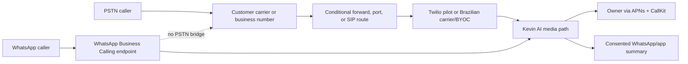

# Brazil Telecom and Market Opportunity Decision Memo

| Field | Value |
| --- | --- |
| Status | **Parked — conditional go for qualification only** |
| Decision date | 2026-08-24 |
| Research currency | Public sources checked through 2026-08-24 |
| Timezone | America/New_York |
| Repository baseline | `6e60e6aba108067689a0ee73bea45be08875d9ae` (`origin/main`) |
| Baseline state | Clean origin/main worktree before this memo; memo branch `codex/brazil-telecom-opportunity-memo` |
| Initial scope if resumed | Kevin Business, one field-service vertical, São Paulo DDD 11 |
| Explicitly deferred | Personal, nationwide/all-carrier support, emergency use, outbound campaigns, unlimited usage |

> This memo preserves research and a falsifiable recommendation. It authorizes
> read-only qualification planning only. It does **not** authorize provider
> outreach, number purchases, spend, credentials, customer recruitment, live
> calls, recording, deployment, production changes, or reliance on legal advice.

## Decision

Brazil is a **conditional business opportunity**, and the narrow technical
problems appear solvable. The recommended entry is not a consumer spam blocker.
It is a metered, inbound AI receptionist for higher-value field-service businesses
that lose jobs when the owner cannot answer.

If this work resumes, the **eventual target** is a paid DDD 11 falsification
pilot—but only after the external-qualification and controlled-laboratory phases
below pass. Missing any prerequisite leaves the initiative parked. Use Twilio to
minimize initial engineering change, while evaluating a licensed Brazilian
carrier over SIP/BYOC as the durability challenger. Keep WhatsApp as an additive
calling, notification, and follow-up channel; it cannot replace PSTN forwarding.

Do not launch Personal in Brazil on the current $9.99 plan. Its dedicated-number,
usage, forwarding-support, and iPhone-only constraints make the current thesis
commercially weak.

## Answers to the research questions

| Question | Finding | Confidence and limit |
| --- | --- | --- |
| Is spam calling a material problem in Brazil? | Yes. Anatel reports that its measures prevented more than 248 billion abusive calls over four years. | High-confidence regulator evidence for the problem; not proof of Kevin demand or willingness to pay. |
| Are there spam calls on WhatsApp? | Yes as a category: Meta says its “Silence Unknown Callers” feature screens spam, scam, and unknown WhatsApp calls. | Product evidence that the category exists. No defensible Brazil-specific prevalence estimate was found. |
| Can WhatsApp replace ordinary carriers? | No. WhatsApp Calling is a separate VoIP endpoint. Twilio rejects WhatsApp-to-PSTN connections. | High-confidence provider contract for Twilio's integration. WhatsApp remains useful alongside PSTN. |
| Can Kevin operate technically in Brazil? | Probably, for a deliberately narrow Business pilot. | Source and public-documentation evidence only. Provider-account, carrier, device, caller, and production behavior remain unproved. |
| Is there a business opportunity? | Yes, conditionally, around recovered high-value inbound jobs. | The market problem and competitive activity are real; channel mix, conversion, retention, and unit economics still require paid evidence. |

## Evidence boundary

The current conclusion rests on two evidence classes:

1. **Published evidence:** regulator, survey, provider documentation, price pages,
   and vendor marketing.
2. **Repository evidence:** source inspection at the exact SHA above.

It does not yet include:

- account-specific DDD 11 inventory, KYC approval, number custody, or port-out;
- a Brazilian telecom/privacy counsel opinion for the exact architecture;
- physical Vivo, Claro, or TIM forwarding and ANI tests;
- physical iPhone CallKit/APNs tests on Brazilian networks;
- current provider invoices, Brazilian tax treatment, or carrier forwarding fees;
- consenting-caller recordings or customer-pilot outcomes; or
- deployed Brazil behavior.

Published provider capability is not account eligibility. Source code is not
provider, device, carrier, caller-heard, legal, or production proof.

## Market evidence and positioning

### The problem is real

[Anatel's abusive-calls page](https://www.gov.br/anatel/pt-br/consumidor/chamadas-abusivas)
reports that, over four years, more than 248 billion calls were prevented, more
than 1,200 company calling blocks occurred, and nearly R$40 million in fines were
applied. Anatel also requires authentication for originators making more than
500,000 calls per month. Its August 2026 anti-spam rules add carrier filtering
criteria based partly on whether call volume and duration fit a legitimate
purpose. These facts validate severe call distrust and make inbound-only,
low-volume behavior strategically safer than outbound automation.

WhatsApp call spam also exists, but the evidence must not be overstated. Meta's
[Silence Unknown Callers announcement](https://about.fb.com/news/2023/06/new-whatsapp-privacy-features-silence-unknown-callers-and-privacy-checkup/)
says the feature helps screen spam, scams, and unknown WhatsApp calls. No reliable
Brazil-specific frequency estimate for WhatsApp **voice-call** spam was found.
Brazil-specific evidence is stronger for WhatsApp message impersonation, phishing,
and compromised-account campaigns than for call prevalence.

### WhatsApp is central, but the small-business extrapolation is limited

[TIC Empresas 2024](https://cetic.br/media/docs/publicacoes/2/20250512122204/tic_empresas_2024_livro_eletronico.pdf)
reports that 74% of surveyed firms used WhatsApp or Telegram. Messaging/chat was
also a major online-sales channel. The survey covers firms with ten or more
employed people and excludes firms with one to nine people, so its percentages
must not be projected directly onto solo MEIs or the intended trades wedge.

The federal [Mapa de Empresas](https://www.gov.br/empresas-e-negocios/pt-br/mapa-de-empresas)
displayed 25.4 million active companies and 485,000 openings in July 2026. That
is context, not TAM. A qualified Kevin customer must be operating, customer-facing,
phone-reliant, missing valuable inbound leads, able to adopt the number/forwarding
model, legally eligible, supportable, and willing to pay. No authoritative source
cross-tabulates those conditions.

An iPhone-only launch also narrows reach. StatCounter measured approximately
22% iOS share of Brazilian mobile web usage in July 2026. This is a usage proxy,
not a device-ownership census, but it is a meaningful scale warning. A successful
Brazil business expansion would probably need an Android or web owner experience.

### Recommended beachhead

Start with one high-value, time-sensitive field-service vertical in DDD 11:

- HVAC/refrigeration;
- plumbing;
- electrical;
- locksmith or appliance repair; or
- towing/automotive service.

The owner is often driving or on a job when an unknown caller represents real
revenue. The promise should be **“recover and qualify jobs you would otherwise
lose,”** not “block spam.” Avoid healthcare first because sensitive-data risk and
local scheduling/WhatsApp competition are higher.

### Competition validates category activity, not demand

Current Brazilian vendor pages advertise telephone AI receptionists at varied
price points. Examples include [Nuvoz](https://www.nuvoz.com.br/) (R$597 for
800 included minutes and R$1,897 for 2,500),
[Toolzz Voice](https://www.toolzz.com.br/lp/ligador-automatico-ia-6ac2a4)
(R$899 and R$1,490 plans displaying up to 1,000 voice-agent minutes), and
[PBXERIX](https://pbxerix.com.br/) (a vendor-claimed starting price of R$99.90).
These are seller-controlled claims, not verified equivalence, adoption, service
quality, retention, tax-inclusive prices, or market share.

Kevin's defensible differentiation would have to be:

- immediate owner monitoring and live takeover;
- reliable Brazilian onboarding and carrier diagnosis;
- trade-specific intake, urgency boundaries, and structured job cards;
- one consented phone-to-WhatsApp customer timeline;
- integrations with calendars, CRM, and dispatch; and
- measurable completed-job contribution, not conversation volume.

## Channel and architecture recommendation

Three durable rules follow:

1. iOS cannot intercept ordinary cellular calls. Kevin always needs forwarding,
   a separate/ported number, or PBX/SIP integration.
2. Kevin cannot recover a call blocked before it reaches Kevin by a carrier,
   handset, or PBX.
3. Twilio documents that WhatsApp endpoints cannot connect to PSTN endpoints.
   WhatsApp Calling is an additional ingress path, not a forwarding substitute.

## Provider shortlist

| Candidate | Best role | Evidence-backed strength | Unresolved hard gate | Recommendation |
| --- | --- | --- | --- | --- |
| **Twilio** | First technical and paid pilot | Existing Kevin integration; documented Brazil local voice pricing and porting workflow; bidirectional Media Streams; existing iOS Voice/CallKit path | Exact DDD inventory, KYC approval, original ANI, forwarding charges, number custody/port-out, latency, data path, and voice-number messaging capability | **Pilot first**, only after written account-specific qualification |
| **Licensed Brazilian carrier + SIP/BYOC** | Long-term durability challenger | Potentially strongest local routing, number ownership, latency, porting, and carrier responsibility | Named carrier, current Anatel authorization, SIP/RTP contract, security, failover, CDR reconciliation, and Kevin media adapter | Evaluate on paper/bench after demand is credible; do not build twice before the pilot |
| **Telnyx** | CPaaS challenger | Documented programmable media/WebRTC and Brazil-facing WhatsApp Business material | Exact DDD/porting/ANI, local partner, data location, account eligibility, and iOS end-to-end proof | RFI and controlled benchmark; no production promise |
| **Infobip** | WhatsApp Calling/SIP alternative | Explicit WhatsApp Calling to SIP/WebRTC/Calls API patterns | Brazil DID/porting/ANI commercial availability and end-to-end economics | RFI if WhatsApp Calling becomes launch-critical |
| **Nvoip** | Local DID/SIP layer or fallback | Broad Brazil virtual-number and porting claims; local voice/SIP presence | Raw bidirectional AI media, owner pickup, header preservation, SLA, and contractual number custody | Consider as a DID/SIP component, not a proven standalone Kevin core |
| **[Zenvia](https://zenvia.com/en/devs/)** | Messaging sidecar | Strong local WhatsApp/SMS positioning | No documented equivalent to Kevin's bidirectional PSTN media and iOS pickup path | Messaging-only shortlist after consent, KYC, DPA, and price qualification |
| **[Vonage](https://developer.vonage.com/en/voice/voice-api/concepts/websockets)** | Contingency | Generic programmable voice/WebSocket support | No adequate public proof of Brazil number inventory or porting for this use | Do not shortlist until written Brazil-number evidence exists |

Relevant provider documentation: [Twilio Brazil prices](https://www.twilio.com/pt-br/voice/pricing/br),
[Twilio Brazil porting](https://help.twilio.com/articles/360053581833),
[Twilio Media Streams](https://www.twilio.com/docs/voice/media-streams),
[Twilio WhatsApp Calling](https://www.twilio.com/docs/voice/whatsapp-business-calling),
[Telnyx media streaming](https://developers.telnyx.com/docs/voice/programmable-voice/media-streaming),
[Telnyx Brazil WhatsApp](https://telnyx.com/pt-br/products/whatsapp-business-api),
[Infobip WhatsApp Calling scenarios](https://www.infobip.com/docs/whatsapp/whatsapp-business-calling/supported-calling-scenarios),
and [Nvoip virtual numbers](https://www.nvoip.com.br/numero-virtual/).

Twilio documents Media Streams only in IE1 and AU1, with US1 as the default; it
does not document a Brazil Media Streams region. Do not conflate a São Paulo edge
in another Twilio product with Brazil residency for this audio path. Measure
latency and obtain a complete data-location map before live use.

## Current Kevin baseline and gaps

The source audit was performed at the pinned SHA. It proves implementation state,
not Brazilian provider behavior.

### Reusable foundations

- Brazil is already listed as supported and as requiring regulatory provisioning
  in [`app/db/contractors.py`](https://github.com/delimatsuo/heykevin/blob/6e60e6aba108067689a0ee73bea45be08875d9ae/app/db/contractors.py#L69-L86).
- The backend has a generic Twilio address, regulatory-bundle, number-purchase,
  and webhook attachment flow in
  [`app/db/contractors.py`](https://github.com/delimatsuo/heykevin/blob/6e60e6aba108067689a0ee73bea45be08875d9ae/app/db/contractors.py#L349-L516).
- The inbound path already connects Twilio calls to Kevin over Media Streams or
  ConversationRelay in
  [`app/webhooks/twilio_incoming.py`](https://github.com/delimatsuo/heykevin/blob/6e60e6aba108067689a0ee73bea45be08875d9ae/app/webhooks/twilio_incoming.py#L41-L100).
- The iOS app already has PushKit, CallKit, and Twilio Voice pickup machinery in
  [`ios/Kevin/App/AppDelegate.swift`](https://github.com/delimatsuo/heykevin/blob/6e60e6aba108067689a0ee73bea45be08875d9ae/ios/Kevin/App/AppDelegate.swift#L42-L169).
- SMS has a central sender-selection seam and fail-closed action gates in
  [`app/services/sms.py`](https://github.com/delimatsuo/heykevin/blob/6e60e6aba108067689a0ee73bea45be08875d9ae/app/services/sms.py#L44-L98).
- Persisted transcripts fail closed on missing AES-256-GCM protection in staging
  and production, and call cleanup currently uses a global 90-day policy in
  [`app/db/calls.py`](https://github.com/delimatsuo/heykevin/blob/6e60e6aba108067689a0ee73bea45be08875d9ae/app/db/calls.py#L1-L64).

### Work required before a Brazil pilot

| Gap | Consequence | Relative complexity |
| --- | --- | --- |
| iOS phone entry and account creation do not deliberately send country, +55, DDD, address, or city ([onboarding](https://github.com/delimatsuo/heykevin/blob/6e60e6aba108067689a0ee73bea45be08875d9ae/ios/Kevin/Views/OnboardingView.swift#L224-L287), [API request](https://github.com/delimatsuo/heykevin/blob/6e60e6aba108067689a0ee73bea45be08875d9ae/ios/Kevin/Services/APIClient.swift#L385-L405)) | Brazilian national-format input can fall into US-default behavior; DDD locality cannot be selected | Medium–high |
| Forwarding UX only distinguishes Verizon from US GSM carriers ([source](https://github.com/delimatsuo/heykevin/blob/6e60e6aba108067689a0ee73bea45be08875d9ae/ios/Kevin/Views/OnboardingView.swift#L656-L742)) | Vivo, Claro, and TIM setup, cancellation, charges, voicemail races, and honest verification are absent | Medium |
| Regulatory bundle uses sparse address data and optimistic 30-second polling ([source](https://github.com/delimatsuo/heykevin/blob/6e60e6aba108067689a0ee73bea45be08875d9ae/app/db/contractors.py#L349-L424)) | It cannot represent full Brazilian KYC, document collection, pending/rejected/remediation states, or account-specific requirements | High |
| Brazil provisioning deliberately searches voice-only numbers while notifications reuse a tenant/global Twilio sender ([provisioning](https://github.com/delimatsuo/heykevin/blob/6e60e6aba108067689a0ee73bea45be08875d9ae/app/db/contractors.py#L468-L516), [SMS](https://github.com/delimatsuo/heykevin/blob/6e60e6aba108067689a0ee73bea45be08875d9ae/app/services/sms.py#L44-L98)) | A working voice DID may not be a valid Brazilian SMS sender | High |
| No WhatsApp runtime path exists in `app` or `ios` | WABA verification, opt-in/templates, webhooks, channel routing, sender ownership, and owner UX must be separate work | High |
| The evident call-cost limit is a fixed 90-minute per-call cutoff ([source](https://github.com/delimatsuo/heykevin/blob/6e60e6aba108067689a0ee73bea45be08875d9ae/app/webhooks/media_stream.py#L870-L876)) | No tenant/tier/monthly metering, included-minute envelope, overage, reconciliation, or Brazil spend kill switch exists | Medium |
| Retention and purge are global, not Brazil policy-driven ([call retention](https://github.com/delimatsuo/heykevin/blob/6e60e6aba108067689a0ee73bea45be08875d9ae/app/db/calls.py#L29-L32)) | LGPD/counsel-approved retention, deletion, subprocessors, and transfer controls cannot be evidenced by current defaults | High |
| Provider abstraction/local SIP adapter is absent | A local-carrier durability path would require SIP security, media bridging, headers, failover, and CDR reconciliation | High |

A narrow pilot is estimated at roughly **8–12 engineering weeks** for two
experienced backend/telephony engineers, one iOS engineer, and Brazilian
operations/compliance support. Provider and counsel lead time is additional and
may dominate. This is a planning estimate, not a schedule commitment.

## Regulatory, privacy, and operational gates

Before live calls, obtain written Brazilian telecom/privacy counsel conclusions
for the exact contracts and data flow. At minimum, resolve:

- Kevin's classification and whether its number assignment, forwarding, resale,
  SIP, or SVA model creates STFC/SCM or other obligations;
- who legally holds each number, and cancellation, release, port-out, and customer
  exit rights;
- lawful basis, controller/operator roles, Portuguese AI/recording disclosure,
  retention, deletion, access, incident, and complaint handling;
- every country where audio, transcripts, backups, logs, support access, and
  model inference occur;
- processor/subprocessor terms and the applicable international-transfer
  mechanism; and
- WhatsApp opt-in, template, business verification, sender ownership, migration,
  and deletion rules.

[ANPD Resolution 19/2024](https://www.gov.br/anpd/pt-br/assuntos/assuntos-internacionais/transferencia-internacional-de-dados)
regulates international transfers and includes Brazilian standard contractual
clauses as one mechanism. Public law and provider terms are counsel inputs, not a
legal approval.

## Preliminary unit economics

All figures below are dated hypotheses. Recalculate from current official prices,
the target account, Brazilian taxes/FX, and actual invoices before using them.

Twilio's public Brazil floor is US$4.25/month for a local number, US$0.0100/min
for inbound local voice, US$0.0044/min for Media Streams, and US$0.0040/min for
an app/browser leg. That excludes AI, messaging, recording/storage, Cloud Run,
support, failed calls, forwarding charges, taxes, FX, refunds, and acquisition.

The scenario model is reproducible as:

`modeled technical COGS = US$4.25 DID + screened minutes × direct-minute assumption + calls × per-call allocation`

| Scenario input | Calls × minutes | Direct-minute assumption | Per-call allocation | Result |
| --- | --- | --- | --- | --- |
| Light current stack | 30 × 3 = 90 min | US$0.0752 | US$0.0604 | `4.25 + 90×0.0752 + 30×0.0604 = US$12.83` |
| Target current stack | 60 × 4 = 240 min | US$0.0752 | US$0.104033 | `4.25 + 240×0.0752 + 60×0.104033 = US$28.54` |
| Heavy current stack | 120 × 5 = 600 min | US$0.0752 | US$0.2020 | `4.25 + 600×0.0752 + 120×0.2020 = US$73.61` |
| Heavy optimized hypothesis | 120 × 5 = 600 min | US$0.0500 | US$0.1055 | `4.25 + 600×0.0500 + 120×0.1055 = US$46.91` |

The direct-minute assumption combines the public telephony floor with modeled
STT/TTS usage. The per-call allocation represents modeled LLM context and
summary, notification, infrastructure, and pickup usage; it rises with longer,
more turn-heavy calls. The optimized row assumes cheaper TTS and lower LLM
context cost and is unproved. These are **technical COGS**, not fully loaded COGS.

For the pilot gate, **fully loaded COGS** means actual technical invoices plus
vendor minimums, messaging, recording/storage, carrier or forwarding subsidies,
tax/FX loss, refunds/failed collections, and allocated onboarding/support labor.
App Store or payment commission is deducted in net proceeds instead of counted
again as COGS. CAC is reported separately with payback; it is not hidden in the
technical model.

The 15% App Store assumption is conditional on eligibility or subscription
tenure; it is not guaranteed. The 30% column is the conservative sensitivity.
See Apple's [subscription economics](https://developer.apple.com/app-store/subscriptions/)
and [Small Business Program](https://developer.apple.com/app-store/small-business-program/).

| Scenario | Price | Technical COGS | Margin after 15% commission | Margin after 30% commission |
| --- | --- | --- | --- | --- |
| Light Business, 90 min | US$49.99 | US$12.83 | 69.8% | 63.3% |
| Target Business, 240 min | US$49.99 | US$28.54 | 32.8% | 18.4% |
| Target Business Pro, 240 min | US$79.99 | US$28.54 | 58.0% | 49.0% |
| Heavy Business, 600 min | US$49.99 | US$73.61 | -73.2% | -110.4% |
| Heavy Business Pro, 600 min | US$79.99 | US$73.61 | -8.3% | -31.5% |
| Optimized heavy Business, 600 min | US$49.99 | US$46.91 | -10.4% | -34.1% |
| Optimized heavy Business Pro, 600 min | US$79.99 | US$46.91 | 31.0% | 16.2% |
| Personal using the light mix, 90 min | US$9.99 | US$12.83 | -51.1% | -83.5% |

Do not offer unlimited usage. A reasonable paid-test hypothesis—not an approved
price—is R$299/month with 150 included AI minutes and R$499/month with 350, plus
a transparent overage or hard stop. Test price with deposits and real renewal,
not interview enthusiasm.

## Recommended qualification and pilot sequence

### Phase 0 — refresh and external qualification

1. Reverify all expired public evidence and the current repository tree.
2. Obtain explicit owner authority for the exact discovery, provider, counsel,
   data, and spend activities before contacting anyone or processing caller data.
3. Approve a data-minimization protocol covering lawful basis, access, redaction,
   retention, deletion, and incident handling. Default discovery to aggregate or
   de-identified counts. Do not collect or inspect caller identifiers, content,
   recordings, or transcripts without separate owner authority and counsel-
   approved handling.
4. After those gates, conduct bounded channel discovery with one DDD 11
   field-service vertical. Prefer aggregate counts of phone, WhatsApp, Instagram,
   portal, and walk-in inquiries plus business-confirmed completed-job outcomes;
   do not rely only on recollection.
5. Obtain counsel and written Twilio/Telnyx/local-carrier answers covering KYC,
   number custody, DDD inventory, ANI, port-out, media/data paths, and pricing.
6. Approve a finite provider/testing budget, number count, duration, data policy,
   and rollback authority.

### Phase 1 — controlled laboratory

- Implement Brazil onboarding/KYC states, sender separation, metering, caps,
  tracing, retention controls, and carrier-specific setup.
- Qualify 200 controlled calls before customer traffic, including Vivo, Claro,
  and TIM target plans; no-answer/busy/unreachable; same/different DDD; ported,
  private, and suspected-spam ANI; VoLTE/VoWiFi; voicemail races; owner pickup;
  APNs failure; WebSocket recovery; and rollback.

### Phase 2 — paid field pilot

- 15 paid CNPJ design partners in one DDD 11 vertical;
- five completed partners per supported Vivo, Claro, and TIM plan family;
- 60 days, at least 1,000 field calls, capped at 150 included AI minutes per
  tenant for the initial commercial test;
- no more than two concurrent calls per tenant, a 15-minute single-call limit,
  and owner-approved per-tenant daily and global pilot spend ceilings enforced
  with automatic traffic stop on breach or a qualifying incident;
- no production porting in the first pilot;
- Twilio only for customer traffic; local SIP/BYOC remains bench/paper work; and
- customer-approved fallback and forwarding-disable instructions rehearsed first.

## Go and kill gates

Commercial success cannot offset a failed legal, privacy, security, number-
recoverability, or carrier-plan gate. Aggregate results cannot hide a failed
carrier-plan cell.

A **claimed carrier-plan cell** is one carrier and plan family, with the
forwarding mode, number type, DDD relationship, device/OS, provider route, and
software SHA recorded. A result qualifies only the cells actually tested.

Before Phase 2, the owner must separately approve a rollback runbook and name the
stop authority. The runbook must cover per-tenant and global disable, provider
routing/fallback, forwarding cancellation, number retention/release, spend stop,
incident communication, and data export/deletion.

### Go only if all pass

| Gate | Numerator/denominator and minimum sample | Pass condition | Proof artifact |
| --- | --- | --- | --- |
| Legal, provider, and rollback authority | One exact architecture/contract set | Unexpired counsel memo has no blocker; provider confirms DDD 11, KYC, holder, cancellation/release/port-out, ANI policy, data path, and prices; owner-approved rollback runbook names stop authority | Executed terms, written provider response, counsel memo, rehearsed rollback record |
| Customer readiness | All 15 recruits; five in each claimed Vivo, Claro, and TIM plan family | At least 13/15 overall and 4/5 in each family are verified-ready within one business day; all 15 within three business days | Timestamped onboarding and verified-forward records |
| Forwarding correctness | All calls configured and expected to forward; at least 200 total and 50 per claimed cell | At least 198/200 overall and 49/50 per cell reach Kevin; zero loops and zero unresolved voicemail races | Carrier CDR, provider CDR, and Kevin trace correlation |
| ANI preservation | Non-private controlled forwarded calls; at least 100 total and 30 per claimed cell | At least 98% overall and 29/30 per cell preserve the provider-supplied original ANI; private/conflicting identity remains unverified | Raw provider/SIP headers, CDRs, and normalized Kevin event |
| Latency | Trace-complete connected calls: at least 100 calls and 30 per cell; at least 300 completed caller turns and 75 per cell | First audible greeting p95 ≤3.0s overall and ≤3.5s per cell; caller-stop-to-Kevin-audio p95 ≤1.5s overall and ≤2.0s per cell | Monotonic timestamps tied to provider media, Kevin output, and caller-side capture |
| Audio and call reliability | Every connected controlled and field call; at least 200 controlled plus 1,000 field, including 300 field calls per claimed cell | Kevin-attributable dropped, silent, or one-way-audio rate <1% overall and <2% in every cell; no repeated systemic defect | Trace-linked incident ledger, provider CDR, and blinded caller/owner disposition |
| Owner takeover | Controlled pickup attempts; at least 105 total and 35 per cell | At least 104/105 overall and 34/35 per cell connect owner and caller without a Kevin-attributable drop | CallKit, APNs, conference, media-transition, and caller-side trace |
| Intake quality and safety | Eligible human calls with a frozen native-pt-BR truth-label rubric; at least 200 total and 50 per cell | At least 75% overall and per cell contain contact, intent, and next action; ≥95% field accuracy overall and per cell; zero fabricated price/availability or unsafe emergency routing | Blinded double review with adjudication and versioned rubric |
| Privacy, deletion, and security | One synthetic tenant plus exact pilot HEAD | Disclosure, export, deletion, provider-log inventory, backup/TTL, tenant isolation, webhook validation, redaction, and spend controls pass with zero unresolved P1 | Deletion report, data map, required CI, and fresh independent security/privacy review |
| Fully loaded economics | All completed accounts for one complete billing cycle; at least 12 accounts | Fully loaded COGS/net proceeds ≤35% at median and ≤55% at p90; no account exceeds 80% before overage/hard stop | Provider/AI invoices, App Store/payment proceeds, support ledger, taxes/FX, refunds, and CDR reconciliation |
| Paid conversion and retention | All 15 receive the same full-price offer; at least 12 complete the pilot | At least 8/15 pay full price and at least 80% of those converters pay a second invoice | Payment receipts; stated willingness does not count |
| Completed-job contribution | At least 12 completed partners with a pre-pilot or randomized-hours baseline | Median incremental completed-job contribution is at least 3× monthly price | Business-confirmed job outcome and contribution ledger using the frozen attribution method |
| Supportability | Every completed account over at least four post-onboarding weeks | Human support ≤30 min/account/month at median and ≤60 min at p90 | Complete time-stamped support ledger |

Missing any go gate blocks progression. If a result misses a go threshold without
triggering a kill threshold, the initiative remains parked and may run **at most
one** bounded remediation: record the causal hypothesis, freeze the metric and
test protocol, produce a new exact SHA, and repeat the full minimum sample for
the affected gate and every affected cell. A second miss stops or narrows the
architecture. A kill trigger invokes the approved rollback immediately.

### Stop or narrow if any trigger occurs

- counsel or provider rejects the customer-number, forwarding, recording,
  transfer, or business model;
- number ownership or port-out/release cannot be made recoverable;
- fewer than 75% of a claimed carrier-plan family become ready within three
  business days after one remediation cycle;
- original ANI fails in more than 5% of non-private calls in any claimed cell;
- Kevin-attributable audio/call-loss remains at or above 2% after one remediation,
  or the same systemic failure occurs three times;
- first-greeting p95 remains above 4.0 seconds or response p95 above 3.5 seconds
  after one architecture remediation;
- any cross-tenant disclosure, unauthorized recording, missing required
  disclosure, unrecoverable sensitive log, or credential compromise occurs;
- median actual COGS exceed 60% or p90 exceeds 90% after enforcing the cap;
- fewer than half of at least 12 completed partners pay the required price;
- phone-originated incremental profit does not cover the price;
- p90 support exceeds two hours/account/month for two pilot months; or
- the business case depends on WhatsApp-to-PSTN bridging or on the $9.99
  Personal plan.

## Evidence expiry and restart rules

| Evidence | Expiry |
| --- | --- |
| Provider inventory, public prices, KYC, account eligibility, APIs, and WhatsApp policy | 30 days; refresh again within seven days of spend/live activation |
| Provider terms, number custody, porting/port-out, SLA, and data-region claims | 60 days or immediately on version/contract change |
| Carrier forwarding codes, supported plans, charges, voicemail, and ANI | 30 days and always re-test on physical lines |
| Anatel/ANPD/LGPD/recording/anti-spam rules | 90 days and again before pilot/production through counsel |
| Counsel opinion | 180 days, or immediately on provider, contract, architecture, data-flow, or law change |
| FX conversion | Seven days |
| Market/spam/channel surveys | 12 months; historical context only after expiry |
| Repository audit | Immediately when relevant source/configuration changes from the pinned SHA |
| Controlled carrier/device qualification | 90 days or immediately on relevant carrier, plan, route, region, codec, app, backend, or OS change |
| Customer-pilot evidence | 180 days for planning; immediately on material architecture or commercial change |
| Verbal statement | Immediate; treat only as a lead until written |

## Provider RFI to use only after owner authorization

Ask every candidate for written answers tied to the exact Kevin legal entity and
account:

1. Which licensed Brazilian carrier supplies each number type and DDD? Who is
   the legal holder, and what are the current Anatel authorization details?
2. Which DDD 11 local, national, toll-free, and mobile numbers are available now?
3. What CNPJ/CPF, address, document, local-area, approval, rejection, and renewal
   workflow applies?
4. Can each number port in and out? State lead time, downtime, fees, rejection
   reasons, cancellation, suspension, and post-pilot disposal.
5. Is original ANI preserved in webhook/CDR/SIP? Document `From`,
   `P-Asserted-Identity`, `Diversion`, and `History-Info` behavior for forwarded,
   ported, private, and suspected-spoof calls.
6. Map the exact PSTN-to-AI-to-owner audio path, countries, POPs, codecs, media,
   recording, transcript, backup, log, and support-access locations; provide
   latency and reliability commitments.
7. Confirm native iOS APNs/CallKit pickup, conference/transfer behavior, WebSocket
   limits, failover, tenant isolation, and credential lifecycle.
8. For WhatsApp, confirm +55 WABA eligibility, sender ownership/migration,
   opt-in/templates, Calling eligibility, SIP/WebRTC routes, and the PSTN bridge
   restriction.
9. Supply DPA, subprocessors, retention/deletion/export controls, incident SLA,
   security attestations, and Brazil transfer mechanism.
10. State complete prices, taxes, minimums, forwarding assumptions, support SLA,
    spend controls, and termination assistance.

## Restart packet

When this initiative is resumed:

1. Read this memo and `docs/agent-operating.md`.
2. Verify the exact worktree, branch, HEAD, tree, and status; fetch `origin/main`.
3. Diff the pinned SHA against current provisioning, routing, media, identity,
   messaging, subscriptions, retention, security, localization, and forwarding
   paths. Do not reuse the source audit across relevant changes.
4. Refresh every expired external fact from direct authoritative sources.
5. Confirm the product remains Business-only, DDD 11, one vertical, inbound-only,
   capped, and WhatsApp-additive. Any broader scope requires a new decision.
6. Obtain new owner authority before provider outreach, spend, credentials,
   design-partner recruitment, live calls, recording, or deployment.
7. The next smallest reversible work is a read-only source refresh and preparation
   of an aggregate/de-identified discovery protocol plus provider/counsel
   qualification packet. Sending that packet, contacting businesses, inspecting
   caller data, implementation, and number purchase remain separately gated.

## Source ledger

On restart, the named initiative lead owns source refresh and records the date,
URL or contract version, and result. The technical owner re-audits the pinned
source/configuration tree; Brazilian counsel owns legal conclusions. An expired
or ownerless item cannot support progression.

| ID | Source | Evidence class | Observed | Expiry rule |
| --- | --- | --- | --- | --- |
| S1 | [Anatel — Chamadas Abusivas](https://www.gov.br/anatel/pt-br/consumidor/chamadas-abusivas) | Regulator | 2026-08-24 | 90 days |
| S2 | [Anatel — anti-spam filtering rules](https://www.gov.br/anatel/pt-br/assuntos/noticias/anatel-estabelece-regras-para-ampliacao-dos-mecanismos-de-bloqueio-automatico-de-chamadas-abusivas-pelas-prestadoras) | Regulator | 2026-08-24 | 90 days |
| S3 | [Cetic — TIC Empresas 2024](https://cetic.br/media/docs/publicacoes/2/20250512122204/tic_empresas_2024_livro_eletronico.pdf) | Survey | 2026-08-24 | 12 months |
| S4 | [Mapa de Empresas](https://www.gov.br/empresas-e-negocios/pt-br/mapa-de-empresas) | Government dashboard | 2026-08-24 | 12 months |
| S5 | [ANPD — international transfers](https://www.gov.br/anpd/pt-br/assuntos/assuntos-internacionais/transferencia-internacional-de-dados) | Privacy regulator | 2026-08-24 | 90 days/counsel |
| S6 | [Twilio Brazil pricing](https://www.twilio.com/pt-br/voice/pricing/br) | Provider price page | 2026-08-24 | 30 days |
| S7 | [Twilio Brazil porting](https://help.twilio.com/articles/360053581833) | Provider documentation | 2026-08-24 | 30 days/account confirmation |
| S8 | [Twilio Media Streams](https://www.twilio.com/docs/voice/media-streams) | Provider documentation | 2026-08-24 | 30 days |
| S9 | [Twilio WhatsApp Calling](https://www.twilio.com/docs/voice/whatsapp-business-calling) | Provider documentation | 2026-08-24 | 30 days/account confirmation |
| S10 | [Meta — Silence Unknown Callers](https://about.fb.com/news/2023/06/new-whatsapp-privacy-features-silence-unknown-callers-and-privacy-checkup/) | Platform product evidence | 2026-08-24 | 12 months |
| S11 | [StatCounter Brazil mobile OS](https://gs.statcounter.com/os-market-share/mobile/brazil) | Third-party usage proxy | 2026-08-24 | 12 months |
| S12 | [Nuvoz](https://www.nuvoz.com.br/), [Toolzz](https://www.toolzz.com.br/lp/ligador-automatico-ia-6ac2a4), [PBXERIX](https://pbxerix.com.br/) | Vendor marketing/prices | 2026-08-24 | 30 days |
| S13 | [Telnyx media streaming](https://developers.telnyx.com/docs/voice/programmable-voice/media-streaming), [Telnyx Brazil WhatsApp](https://telnyx.com/pt-br/products/whatsapp-business-api) | Provider documentation/marketing | 2026-08-24 | 30 days/account confirmation |
| S14 | [Infobip WhatsApp Calling scenarios](https://www.infobip.com/docs/whatsapp/whatsapp-business-calling/supported-calling-scenarios) | Provider documentation | 2026-08-24 | 30 days/account confirmation |
| S15 | [Nvoip virtual numbers](https://www.nvoip.com.br/numero-virtual/) | Provider marketing | 2026-08-24 | 30 days/written contract |
| S16 | [Zenvia developer platform](https://zenvia.com/en/devs/) | Provider documentation/marketing | 2026-08-24 | 30 days/account confirmation |
| S17 | [Vonage Voice WebSockets](https://developer.vonage.com/en/voice/voice-api/concepts/websockets) | Provider documentation | 2026-08-24 | 30 days; no Brazil-number inference |
| S18 | [Apple subscriptions](https://developer.apple.com/app-store/subscriptions/), [Small Business Program](https://developer.apple.com/app-store/small-business-program/) | Platform commercial terms | 2026-08-24 | 30 days/account eligibility |
| S19 | [Kevin source tree at the audited SHA](https://github.com/delimatsuo/heykevin/tree/6e60e6aba108067689a0ee73bea45be08875d9ae) | Immutable repository source | 2026-08-24 | Immediately on relevant source/config change |

## Decision history

- **2026-08-24:** Research parked. Conditional go retained for qualification
  only: Business, DDD 11, one high-value field-service vertical, Twilio first,
  local SIP/BYOC challenger, capped usage, Personal deferred, WhatsApp additive.
