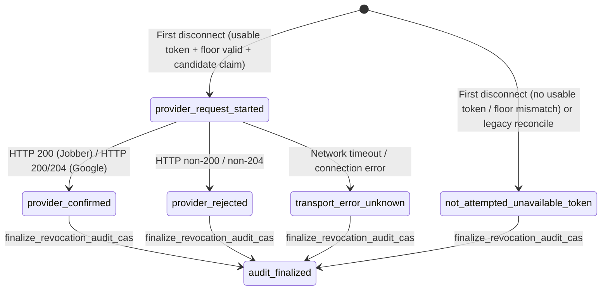

# Runbook: Integration Token Encryption Envelope

## Overview
This runbook defines the key generation, deployment order, key rotation, multi-instance coordination, and rollback constraints for the versioned, context-bound AES-256-GCM integration token envelope in Hey Kevin.

---

## 1. Key Generation & Secret Provisioning

### Generating a Key
Each key version must be an exact 32-byte cryptographically secure random key, standard base64-encoded:

```bash
python3 -c "import os, base64; print(base64.b64encode(os.urandom(32)).decode('ascii'))"
```

### Formatting the Environment Variables
- `INTEGRATION_TOKEN_ENCRYPTION_KEYS`: A canonical JSON object mapping positive decimal version strings to base64-encoded 32-byte keys.
- `INTEGRATION_TOKEN_ACTIVE_KEY_VERSION`: The canonical positive integer version used for all new writes (must be a canonical string with no leading zeroes or whitespace padding).
- `INTEGRATION_TOKEN_ENCRYPTED_WRITES_ENABLED`: The boolean activation flag (`false` by default).

Example for initial deployment:
```json
INTEGRATION_TOKEN_ENCRYPTION_KEYS='{"1":"<32-byte-base64-key-v1>"}'
INTEGRATION_TOKEN_ACTIVE_KEY_VERSION="1"
INTEGRATION_TOKEN_ENCRYPTED_WRITES_ENABLED="false"
```

---

## 2. Pair-Valid Provider Boundary & Durable Monotonic Envelope Floor

### Pair-Valid Provider Boundary (`resolve_usable_token_pair`)
For a contractor's integration credentials to be usable by any subsystem (Gemini voice pipeline, receptionist context, job creation, or background token refreshes), BOTH `access_token` and `refresh_token` must be present, non-empty, and valid at the same time:
- **Allowed Representations**: EITHER both are exact valid plaintext strings, OR both are authenticated AES-256-GCM envelope dictionaries bound to the specific contractor and provider.
- **Fail-Closed Resolution**: Any absent, one-sided, mixed (`str` + `dict`), malformed, unknown-key, or tampered pair returns `(None, None)`.
- **Zero HTTP Calls on Invalid Boundary**: Downstream clients make zero provider HTTP requests when token pair resolution fails.

### Durable Monotonic Envelope Floor (`token_envelope_required`)
Each provider tracks a server-owned, protected boolean field (`jobber_token_envelope_required`, `google_calendar_token_envelope_required`):
- **Monotonic Floor**: Once an encrypted envelope has ever been durably stored for a contractor and provider, the floor field is set to `true` and remains `true` monotonically across disconnects and reconnects.
- **Downgrade Rejection**: If `envelope_required` is `true`, any attempt to write or refresh plaintext credentials fails closed under CAS (`IntegrationTokenEnvelopeError`) with zero mutations.
- **Envelope Reconnect Requirement**: When `envelope_required` is `true`, reconnects require encrypted envelope writes even if the global configuration flag `INTEGRATION_TOKEN_ENCRYPTED_WRITES_ENABLED` is currently `false`.

### Disconnect Lifecycle & Envelope Floor Preservation
Provider disconnection (`disconnect_provider_cas`) executes atomically under CAS:
- **Representation-Independent Deletion**: Credentials, claims, and refresh timestamps are tombstoned using `firestore.DELETE_FIELD`, advancing the generation integer and recording a durable audit event. Disconnect is never blocked by malformed, unknown-key, mixed, or corrupt credentials.
- **Conservative Floor Preservation & Normalization**: If `token_envelope_required` was exact `true`, if either raw stored credential was an envelope dictionary (even if corrupted, tampered, or missing a decryption key), OR if `token_envelope_required` was present with any non-boolean malformed value (e.g. `1`, `'true'`, `None`, `list`, `dict`), `token_envelope_required` is conservatively normalized to exact boolean `true` in the same atomic update. This guarantees cleanup cannot strand the account in an un-reconnectable state or permit a plaintext downgrade after ambiguous history. Exact `false` with no envelope credentials remains `false`/unenforced.
- **Non-Blocking Revocation**: Best-effort provider revocation errors or decryption failures never block credential deletion or disconnect CAS commit.

---

## 3. Rollout Sequence (Single Compatibility Release + Configuration Activation)

To guarantee zero downtime and prevent decryption failures or token downgrades during deployment, releases must follow this exact sequence:

> [!IMPORTANT]
> **Owner-Gated Release Process**
> Source unit tests prove in-memory and simulated CAS/crypto contracts, but DO NOT prove Cloud Run deployment, secret provisioning, live provider authorization, or traffic routing. Secret creation, configuration updates, deployment, and live provider qualification are strictly owner gates.

### Step 1: Merge Compatibility Source Release
- **Code Merged**: One compatibility source PR containing:
  - Envelope-aware pair-valid readers (`resolve_usable_token_pair`, `resolve_usable_token`, `has_usable_token`) across all consumers
  - Envelope-aware and legacy-string-aware Jobber and Google Calendar read/refresh paths
  - Transactional CAS mutations (`persist_refreshed_tokens_cas`, `connect_provider_cas`, `disconnect_provider_cas`)
  - Multi-instance cross-process leases (`acquire_refresh_claim_cas`, `release_refresh_claim_cas`) with per-attempt retry clocks
  - Durable monotonic envelope floor enforcement across all write and disconnect paths
  - Closed-schema lifecycle audit trail
  - Centralized monotonic write-format policy (`determine_write_format`)
  - Default-off activation flag (`INTEGRATION_TOKEN_ENCRYPTED_WRITES_ENABLED=false`)

### Step 2: Provision Secrets & Deploy Compatibility Revision (Rollback Floor)
- Owner provisions `INTEGRATION_TOKEN_ENCRYPTION_KEYS` and `INTEGRATION_TOKEN_ACTIVE_KEY_VERSION` in Cloud Run Secret Manager / environment for staging, then production.
- Deploy the exact compatibility source SHA with `INTEGRATION_TOKEN_ENCRYPTED_WRITES_ENABLED=false`.
- **Permanent Rollback Floor Established**: Verify and record the deployed Cloud Run revision ID, source commit SHA, active key versions, reader decryptability, and monotonic write-policy capability.
- In this state, existing plaintext records remain plaintext, while any existing envelope records are preserved as envelopes.

### Step 3: Enable Encrypted Writes (Configuration Revision)
- Enable encrypted writes by deploying a configuration-only revision setting `INTEGRATION_TOKEN_ENCRYPTED_WRITES_ENABLED=true` with the **SAME** source commit SHA and keyring, staging first before production.
- All new connections and token refreshes now persist as v1 AES-256-GCM encrypted envelopes and establish the durable `token_envelope_required` floor.
- **Mixed-Revision Traffic Behavior**: During traffic migration between Step 2 and Step 3 instances:
  - Flag-off instances (Step 2) preserve existing envelopes and never downgrade them to plaintext (enforced by `determine_write_format` and `token_envelope_required`).
  - Never-encrypted records touched by Step 2 remain plaintext until refreshed by a Step 3 instance.
  - No records are corrupted, broken, or downgraded.

---

## 4. Key Rotation & Retention Procedure

When rotating to a new key version (e.g. from version `1` to version `2`):

1. **Generate New Key**: Generate a fresh 32-byte key for version `2`.
2. **Append to Keyring (Retain All Historical Keys)**:
   ```json
   INTEGRATION_TOKEN_ENCRYPTION_KEYS='{"1":"<key-v1>","2":"<key-v2>"}'
   ```
3. **Switch Active Key Version**:
   ```
   INTEGRATION_TOKEN_ACTIVE_KEY_VERSION="2"
   ```
4. **Deploy Environment Update**:
   - Reads with `key_version: 1` decrypt transparently using key `1`.
   - All new OAuth callbacks and token refreshes write `key_version: 2`.
   - Historical keys must be retained in the keyring JSON until all existing contractor documents have been refreshed or migrated.

---

## 5. Rollback Constraints & Forbidden Rollback Rules

> [!CAUTION]
> **CRITICAL ROLLBACK CONSTRAINT**
> Once Step 3 (Encrypted Writes Enabled) is live and any contractor document has had an encrypted token envelope written to Firestore:
> - You MAY roll back to Step 2 (the verified Keys-Present, Flag-Off Compatibility Revision) at any time. Step 2 instances can read envelopes and will maintain envelope representation under CAS without downgrading.
> - You must **NEVER** roll back to any pre-compatibility codebase or keyless revision. Pre-compatibility revisions cannot parse envelope dicts and will treat them as missing or invalid credentials.
> - All referenced historical keys MUST be retained in the keyring during rollback.

---

## 6. Jobber Refresh Token Rotation & Multi-Instance Coordination

### Jobber Single-Use Token Rotation Contract
According to Jobber's API documentation ([Jobber Refresh Token Rotation](https://developer.getjobber.com/docs/building_your_app/refresh_token_rotation/)), Jobber issues a single-use refresh token. When exchanged, the previous refresh token is immediately invalidated on Jobber's authorization server and replaced by a new `(access_token, refresh_token)` pair.

### Cross-Process Coordination & Two-Phase Refresh Claims (Durable Lease in Firestore)
Because in-process locks only protect threads within a single Cloud Run container, cross-process and multi-instance coordination is enforced via a two-phase durable Firestore lease claim before making the HTTP call to the provider:
1. **Phased Lease Acquisition (`reserved` -> `provider_request_started`)**:
   - `acquire_refresh_claim_cas`: The primary instance transactionally acquires a 60-second lease with phase `reserved`, bound to the contractor ID, provider, observed generation, and exact raw credentials. On transaction retries, lease expiry is freshly recomputed from Firestore snapshot `read_time` server timestamp.
   - `transition_refresh_claim_to_started_cas`: Immediately prior to dispatching the outbound HTTP token refresh request, the claim phase is transitioned to `provider_request_started`.
2. **Contenders**: Any concurrent instance observing an active lease makes **zero HTTP calls** to the provider. The contender inspects the durable document; if the winning instance advanced the generation and committed, the contender reloads the winner's fresh tokens.
3. **Commit & Mandatory Started-Lease Invariant**: Token persistence via `persist_refreshed_tokens_cas` strictly enforces that an active, unexpired, matching lease claim in phase `provider_request_started` is present on the contractor document at commit time, comparing held expiry against fresh server snapshot time on every transaction attempt. Unclaimed, expired, or wrong-phase refresh attempts fail closed without writing tokens.
4. **Release**: Upon successful commit, lease fields are atomically deleted in the CAS transaction. If a `reserved` claim is released before dispatch, `release_refresh_claim_cas` clears the lease fields.

### Durable Unknown-Outcome Quarantine & Reauthorization State Machine
In distributed systems, network partitions or process crashes during token rotation may leave provider credentials in an ambiguous state (the provider may have rotated and invalidated the old refresh token while the new refresh token was not persisted).
- **Quarantine Establishment**:
  - If a refresh request in phase `provider_request_started` fails (network error, timeout, HTTP non-200, invalid JSON, or missing tokens), or if an expired claim in phase `provider_request_started` is encountered by a subsequent lease acquirer, `quarantine_provider_reauth_cas` atomically transitions the contractor into quarantine:
    - `{provider}_refresh_outcome_unknown = true`
    - `{provider}_reauthorization_required = true`
    - All claim fields are cleared.
- **Fail-Closed Snapshot Linearization**: `load_durable_provider_snapshot` and `resolve_usable_token_pair` immediately fail closed when `{provider}_reauthorization_required` or `{provider}_refresh_outcome_unknown` is `true`. Zero downstream provider HTTP requests are permitted while in quarantine.
- **Recovery Procedure (Manual Reauthorization)**:
  - Resolution requires manual contractor reauthorization via the standard OAuth connect flow (`GET /api/integrations/{provider}/connect` or Settings in the iOS app).
  - Calling `connect_provider_cas` clears `{provider}_refresh_outcome_unknown` and `{provider}_reauthorization_required`, advances `{provider}_lifecycle_epoch` (+1) and `{provider}_generation` (+1), and establishes fresh valid credentials.

### Lifecycle Epoch & Bound OAuth State Machine
To prevent stale, concurrent, or cross-account OAuth authorization callbacks from overwriting credentials after a disconnect or reconnect:
1. **Server-Owned Lifecycle Epoch (`{provider}_lifecycle_epoch`)**:
   - Monotonically incremented integer (+1) on every `connect_provider_cas` and `disconnect_provider_cas`.
   - Preserved across routine background token refreshes.
2. **Transactional State Creation (`create_oauth_state`)**:
   - Generates a cryptographically random state token and transactionally records it in Firestore with a 10-minute TTL, bound to the contractor's current `lifecycle_epoch`, `generation`, and raw credentials SHA-256 fingerprint.
3. **Atomic State Consumption & Pre-Exchange Verification (`consume_oauth_state`)**:
   - The OAuth callback atomically retrieves and deletes the state token.
   - Before dispatching the outbound HTTP token exchange request to the provider, the callback reads the fresh durable contractor document and validates that `lifecycle_epoch`, `generation`, and `credentials_fingerprint` match the OAuth state.
   - Any disconnect, concurrent reconnect, or credential mutation that occurred while the user was in the OAuth consent screen causes pre-exchange abort with HTTP 400/409, making zero HTTP calls to the provider.

### Legacy Contractor Compatibility & Transactional Metadata Normalization
Baseline production records stored valid `access_token` and `refresh_token` credentials without explicit `provider_connected`, `provider_generation`, or `provider_lifecycle_epoch` fields.
- **Transactional Metadata Normalization**: When all three lifecycle fields are absent on a fresh active record with valid credentials and valid floor, `load_durable_provider_snapshot` transactionally normalizes `provider_connected = true`, `provider_generation = 0`, and `provider_lifecycle_epoch = 0` under exact raw-pair and floor CAS, postverifies durable state, and authorizes.
- **Fail-Closed on Partial or Explicit Disconnect**: Any record with partial lifecycle fields present, explicit `provider_connected = false`, or non-boolean malformed values fails closed and is never normalized.
- **First Refresh Transition**: A successful legacy refresh automatically persists `provider_connected = true` and advances generation 0 to 1.

### Irreducible Crash Risk Residual
In distributed systems, no mechanism can provide 100% "exactly-once" delivery across separate network domains. In the irreducible edge case where the provider executes token rotation and the server crashes before `persist_refreshed_tokens_cas` completes:
- The expired `provider_request_started` claim persists until the next interaction.
- Any subsequent attempt to acquire a refresh lease detects the expired `provider_request_started` claim and immediately transitions the record into durable reauthorization quarantine (`{provider}_reauthorization_required = true`).
- Downstream callers fail closed without sending invalid tokens to the provider, preventing repeated authentication error storms.
- Recovery proceeds safely via manual OAuth reauthorization.

---

---

## 7. Durable Idempotent Revocation & Revocation Outbox State Machine

### Closed Schemas, Valid Actors & Reasons, and Pair Coherence
To guarantee at-most-once provider revocation, prevent duplicate provider HTTP calls, and maintain an immutable, tamper-evident record of contractor credential destruction, two deterministic records are maintained in Firestore under exact closed schemas and proven by a pure pair validator:
1. **Lifecycle Audit Record** in collection `integration_lifecycle_audit` with document ID `{contractor_id}_{provider}_{generation}_credentials_deleted`.
   - Closed key set: `schema_version`, `contractor_id`, `provider`, `generation`, `lifecycle_epoch`, `action`, `actor`, `reason`, `credential_deletion_disposition`, `revocation_status`, `revocation_completed_at`, `created_at`, `timestamp`.
   - `generation` and `lifecycle_epoch` are exact non-negative integers (`>= 0`, supporting generation 0 legacy reconciliation).
   - `action` is fixed to `"credentials_deleted"`.
   - `actor` must be an exact member of `VALID_DISCONNECT_ACTORS` (`"contractor_api"`, `"admin_api"`, `"system_reconciliation"`).
   - `reason` must be an exact member of `VALID_DISCONNECT_REASONS` (`"contractor_initiated_disconnect"`, `"legacy_reconciliation"`, `"admin_initiated_disconnect"`, `"user_requested_disconnect"`).
   - `credential_deletion_disposition` is an exact closed enum: `"executed"`, `"partial_reconciled"`, or `"legacy_reconciled"`.
   - `revocation_status` is an exact enum: `"provider_request_started"`, `"provider_confirmed"`, `"provider_rejected"`, `"transport_error_unknown"`, or `"not_attempted_unavailable_token"`.
   - `created_at` and `timestamp` are exact equal positive floats (`timestamp == created_at`).
   - `revocation_completed_at` is `None` while `revocation_status == "provider_request_started"`, and is an exact finite float (`>= created_at`) when terminal.
2. **Revocation Outbox Record** in collection `integration_revocation_outbox` with document ID `{contractor_id}_{provider}_{generation}_credentials_deleted`.
   - Closed key set: `schema_version`, `contractor_id`, `provider`, `generation`, `lifecycle_epoch`, `status`, `claim_id`, `audit_finalized`, `audit_finalized_at`, `created_at`, `updated_at`, `credential_deletion_disposition`.
   - Temporal invariants: `created_at` and `updated_at` are finite positive floats with `updated_at >= created_at`.
   - Status-specific shapes:
     - `status == "provider_request_started"`: `claim_id` is a non-empty string, `audit_finalized is False`, `audit_finalized_at is None`, and `updated_at == created_at`.
     - `status in ("provider_confirmed", "provider_rejected", "transport_error_unknown")`: `claim_id` is a non-empty string. If `audit_finalized is True`, `audit_finalized_at >= updated_at`.
     - `status == "not_attempted_unavailable_token"`: `claim_id is None`. If `audit_finalized is True`, `audit_finalized_at >= updated_at`.
3. **Immutable Finalized-Pair Contract (`validate_disconnect_lifecycle_pair`)**:
   - Both records must match on `contractor_id`, `provider`, `generation`, `lifecycle_epoch`, `credential_deletion_disposition`, `created_at`, and `schema_version`.
   - When finalized (`audit_finalized is True`), the audit record must match the outbox status and have `revocation_completed_at == outbox.updated_at`. Once finalized, records are immutable; subsequent finalizer calls return idempotent success with zero writes and reject stale or mismatched audit states.



### Representation & Presence-Aware Floor Rules
Access token extraction for provider revocation and tombstone validation are pure, presence-aware, and fail-closed:
- **Presence-Aware Floor Check**:
  - Key absent: Allowed (`_FLOOR_ABSENT`).
  - Key present with exact `bool` (`False` or `True`): Allowed.
  - Key present with `None` or non-bool: Malformed. `is_durable_provider_tombstone` returns `False` (forcing CAS mutation) and `extract_revocation_access_token` returns `None` (zero HTTP).
- **Floor Normalization**:
  - In `disconnect_provider_envelope_cas`, any document requiring mutation with a present malformed floor, an existing `True` floor, or dictionary credentials normalizes `provider_token_envelope_required` monotonically to exact `True`.
  - Documents with an explicit `False` floor and no dictionary credentials keep `False`. Documents without floor and without dictionary credentials leave the floor absent.
- **Explicit Generation Binding**:
  - `extract_revocation_access_token` binds and validates the snapshot's exact `generation` against the expected generation.
- **Plaintext Access**: Permitted ONLY when the envelope floor is absent or exact `False` AND both access and refresh tokens are valid non-empty plaintext strings.
- **Envelope Access**: Permitted ONLY when both access and refresh tokens are structurally valid, canonical envelopes that decrypt successfully in the exact contractor/provider/generation context.

### Deterministic Create-Only & Zero Overwrite Semantics
- **New Generations**: On any real disconnect advancing generation (`current_gen + 1`), deterministic audit and outbox documents are created with `transaction.create`. Any pre-existing document raises `IntegrationTokenCASConflict`, preventing corrupt overwrites.
- **First Disconnect with Unavailable Token**: Atomically creates an already-finalized coherent terminal pair (`not_attempted_unavailable_token`, `claim_id = None`, `audit_finalized = True`, `created_at = updated_at = audit_finalized_at = revocation_completed_at = server_now`).
- **Legacy Already-Disconnected Tombstones**:
  - Both records exist: Validated with `validate_disconnect_lifecycle_pair` and reused with zero writes. Incoherent pairs fail closed with `IntegrationTokenCASConflict`.
  - Neither record exists: Atomically creates a coherent finalized generation-0/current-gen pair via `transaction.create`.
  - Outbox exists, audit missing: Reconstructed ONLY if the outbox is an exact finalized terminal record. Started or unfinalized outboxes fail closed with zero writes.
  - Audit exists, outbox missing: Fails closed with `IntegrationTokenCASConflict` (zero writes) because outbox state cannot be unambiguously derived from a lone audit.

### At-Most-Once Provider Revocation via Claim Ownership
1. **Candidate Claim Minting & Atomic Commit**:
   - Before entering the disconnect transaction, a cryptographically random `claim_candidate` is minted.
   - The transaction atomically deletes credentials from the contractor document, advances `generation` (+1) and `lifecycle_epoch` (+1), and writes the `credentials_deleted` audit record and `integration_revocation_outbox` document in phase `provider_request_started` with `claim_id = claim_candidate`.
   - Only the single caller whose `claim_candidate` matches the durably committed `claim_id` on the outbox record receives the ephemeral plaintext access token and is authorized to execute the outbound revocation HTTP request.
2. **Contenders and Repeat Disconnects**:
   - Any concurrent or repeated disconnect call observing an already-disconnected contractor document inspects the existing outbox and audit records.
   - Contenders receive `claim_id = None` and `access_token = None`, making **zero provider HTTP calls**.
   - Repeated calls return the existing durable generation, lifecycle epoch, and audit/outbox IDs without advancing generation or duplicating records.

### Fail-Closed Orchestration after Attempted HTTP
1. **Single DB Handle Resolution**:
   - `disconnect_and_revoke_provider_orchestration` resolves/acquires a single Firestore database handle at entry and passes that exact handle through disconnect, outcome CAS, finalizer CAS, and independent re-reads.
2. **Fail-Closed Outcome Persistence**:
   - After provider HTTP is attempted, if `record_revocation_outcome_cas` fails or raises, orchestration independently reads the outbox record and validates it against the expected contractor, provider, generation, epoch, and claim ID.
   - If the durable outbox is confirmed in an expected terminal state (`status in TERMINAL_REVOCATION_STATUSES` with matching `claim_id`), orchestration continues from durable truth.
   - If the durable outbox remains `provider_request_started`, is missing, or is malformed, orchestration **fails closed with `IntegrationTokenCASConflict`** so the caller does NOT receive a 200 OK disconnected status with unpersisted revocation truth. Orchestration never retries HTTP.
3. **Structured Response Contract**:
   - Response includes:
     - `audit_finalization`: `{"status": "finalized" | "pending", "finalized": bool, "attempted_by_this_request": bool}`.
     - `credential_deletion`: `{"status": str, "attempted_by_this_request": bool}`.
     - `provider_revocation`: `{"status": str, "attempted": bool, "attempted_by_this_request": bool}`.
   - Zero secret fields, claim IDs, or unredacted provider payloads are logged or returned.

### Irreducible Crash Window on Revocation
In the rare event that a Cloud Run container crashes while the outbox is in `provider_request_started` (either before or after the provider HTTP request is dispatched):
- The outbox record truthfully persists in `provider_request_started` (outcome unknown).
- No automatic background retry is permitted because contractor credentials have already been permanently deleted and duplicate token revocation is forbidden.
- Source unit tests and offline test harnesses prove the CAS state machine and idempotency contracts, but live provider behavior, emulator semantics, and production networking require owner-gated staging verification.

---

## 8. Invariant Matrix & Defense-in-Depth Mechanics (Repair 18B2C)

| Item | Invariant & Defense Mechanism | Enforcement Point |
|------|-------------------------------|-------------------|
| **C-1** | **Overflow Stop Lines**: Stop lines strictly reject any attempt to advance `generation` or `lifecycle_epoch` past `MAX_KEY_VERSION` before creating or queuing mutations. | `integration_token_mutations.py` (`connect_provider_cas`, `disconnect_provider_envelope_cas`, `persist_refreshed_tokens_cas`) |
| **C-2** | **Generation-Bound Token Extraction**: `extract_revocation_access_token` strictly validates presence and exact type of `generation` on the snapshot matching expected generation before decrypting credentials. | `extract_revocation_access_token` in `integration_token_mutations.py` |
| **C-3** | **Closed Schema Validation**: Closed-schema validators (`validate_disconnect_audit_record`, `validate_outbox_record`, `validate_disconnect_lifecycle_pair`, `validate_lifecycle_audit_record`) reject any unexpected keys and enforce exact types. | `integration_lifecycle_audit.py` |
| **C-4** | **Atomic Outcome CAS**: `record_revocation_outcome_cas` reads, validates, and transacts against both the audit and outbox pair simultaneously. | `record_revocation_outcome_cas` in `integration_token_mutations.py` |
| **C-5** | **Pre-Mutation Pair-Validation**: `finalize_revocation_audit_cas` executes complete pair-validation BEFORE applying any writes. | `finalize_revocation_audit_cas` in `integration_token_mutations.py` |
| **C-6** | **Tombstone Proof in Orchestration**: `disconnect_and_revoke_provider_orchestration` independently rereads and proves the contractor document is a durable tombstone before returning HTTP 200. | `disconnect_and_revoke_provider_orchestration` in `integration_token_mutations.py` |
| **C-7** | **Sanitized Diagnostics**: Diagnostic error messages never format or expose claim candidate values or unredacted token payloads. | `integration_token_mutations.py` |
| **C-8** | **Genuine Contention Test Suite**: Offline test suite validates OCC contention, concurrent HTTP mock revocation races, single-revocation ownership, and idempotency contracts. | `tests/unit/test_integration_token_envelope.py` |

---

## 9. Strict Contract Semantics & Durable Ambiguity Rules (Repair 18H)

### Exact 000 / 111 Lifecycle Counter Invariants
- **Legacy Unnormalized (000)**: All three lifecycle counter keys (`connected`, `generation`, `lifecycle_epoch`) must be completely absent. Parsed as `(True, 0, 0, False, None)` with `lifecycle_present = False`.
- **Normalized Lifecycle (111)**: All three counter keys must be present simultaneously. `connected` must be exact `bool`, `generation` and `lifecycle_epoch` must be exact non-negative bounded built-in integers (`0 <= val <= MAX_KEY_VERSION`). Parsed as `(True, gen, epoch, True, None)`.
- **Partial/Hostile Rejection**: Any partial combination (100, 010, 001, 110, 101, 011), `bool` subclasses, floats, `None`, strings, negative numbers, or overflow values fail closed with `(False, 0, 0, False, error_detail)`.

### Canonical Durable Quarantine Schema
- **Exact True/True Schema**: `parse_provider_operation_intent` accepts durable quarantine ONLY when both `outcome_unknown` and `reauthorization_required` fields are present as exact built-in boolean `True`, and zero operation intent or legacy claim fields coexist.
- **Fail-Closed Malformed Rejection**: Both `False`, mixed booleans (`True`/`False`), partial presence, `None`, non-booleans, or coexistence with intent/claim fields are classified as `malformed`.

### Durable Jobber Ambiguity & Provider Request Started Preservation
- **Ambiguity Exceptions**: `_graphql_request` raises `JobberNetworkError` on network timeouts, transport failures, invalid JSON/payload type, HTTP status codes 408/425/429, and all HTTP 5xx responses.
- **Intent Preservation**: On `JobberNetworkError`, `_graphql_request_with_refresh` does NOT terminalize the acquired operation intent; `provider_request_started` remains durably intact on the contractor document.
- **Terminal Rejection**: Only responses proving explicit provider rejection (e.g. 400 Bad Request, 403 Forbidden, 404 Not Found) return a terminal status. 401 Unauthorized triggers the single-retry refresh path via `JobberAuthError`.
- **Sanitized Logging**: Log entries record operation, class, and status codes only, never URLs, request/response bodies, tokens, or raw exception strings.

### Retry-Safe Lead-Capture Audit Candidates
- **Stable Pre-Minted Audit Candidate ID**: `update_jobber_lead_capture_cas` pre-mints a single random candidate ID (`audit_candidate_id`) using `secrets.token_hex(8)` outside the transaction callback. This exact ID is reused across transaction retries and ambiguous recovery reads.
- **Atomic State Transitions**: A state-changing lead capture toggle atomically executes a single `transaction.create` for the audit document and `transaction.update` for the contractor document. No-op toggles issue zero writes and do not update `jobber_lead_capture_updated_at`.
- **Dual Document Recovery Proof**: Both normal and ambiguous postreads verify exact contractor fields AND the exact created audit document payload. Server timestamps are never used as document identities.

### Terminal Disconnect Requirement
- **Terminal Status Requirement**: `disconnect_and_revoke_provider_orchestration` returns a `disconnected` status ONLY when the durable outbox status is confirmed in `TERMINAL_REVOCATION_STATUSES` (`provider_confirmed`, `provider_rejected`, `transport_error_unknown`, `not_attempted_unavailable_token`).
- **Non-Terminal Fail Closed**: If durable outbox status remains `provider_request_started` (or unconfirmed), orchestration fails closed with `IntegrationTokenCASConflict`, preventing an unverified `disconnected` success status.

---

## 10. Quarantined Reauthorization Attempt Protocol & Complete Tuple Binding (Repair 18Q-A)

### Isolated Reauthorization Attempt Namespace
- **Closed Schema**: Reauthorization attempts under True/True quarantine use an isolated closed-schema namespace (`{provider}_reauthorization_attempt_id`, `kind="reconnect"`, `phase` in `"reserved"`/`"provider_request_started"`, `expires_at`, `acquired_at`, `generation`, `lifecycle_epoch`, `credentials_fingerprint`).
- **Quarantine Coexistence**: Ordinary operation intent fields (`{provider}_operation_intent_*`) are strictly forbidden from coexisting with True/True quarantine (`reauthorization_required: True` and `refresh_outcome_unknown: True`). Coexistence parses as `malformed`.
- **Protected Fields**: All `reauthorization_attempt_*` keys are listed in `PROTECTED_FIELDS` in `app/db/contractors.py` to prevent client overwrite via API PATCH.

### Phase Lifecycle & Exclusive Blocking
1. **State Consumption**: `consume_oauth_state` under True/True quarantine writes `{provider}_reauthorization_attempt_*` keys in phase `reserved`, retaining True/True quarantine.
2. **Pre-Dispatch Transition**: Callbacks transition attempt phase from `reserved` to `provider_request_started` via `transition_provider_reauthorization_attempt_to_started_cas` before provider HTTP exchange.
3. **Exclusive Fence**: `connect_provider_cas` under quarantine requires attempt phase EXACTLY `provider_request_started`. Attempt phase `reserved` fails byte-identical.
4. **Exclusive Path Blocking**: Disconnect and all ordinary mutation/snapshot/business/refresh paths block both `quarantined` and `quarantined_reauthorizing` states. Only the explicitly typed OAuth callback recovery path may act on `quarantined_reauthorizing`.

### Terminalization & Ambiguity Retention
- **Deterministic Terminalization**: Pre-dispatch failures (such as encryption unconfigured) or explicit HTTP 400 terminal rejections invoke `terminalize_provider_reauthorization_attempt_cas`, deleting attempt keys while retaining True/True quarantine.
- **Ambiguity Retention**: Transport errors, timeouts, HTTP 408/425/429/5xx/599, invalid JSON, non-dict payloads, and persistence failures RETAIN True/True quarantine PLUS the started attempt (`provider_request_started`). Retry calls block before making a second HTTP exchange.
- **Fresh Google Refresh Token Requirement**: Quarantine recovery for Google Calendar requires a newly returned `refresh_token` in the provider response; falling back to stored/quarantined refresh tokens is forbidden (HTTP 502).

### Authoritative Complete Tuple Binding
- All CAS mutations (`transition_provider_operation_intent_to_started_cas`, `transition_refresh_claim_to_started_cas`, `transition_provider_reauthorization_attempt_to_started_cas`, `persist_refreshed_tokens_cas`, `quarantine_provider_reauth_cas`, `connect_provider_cas`) validate the complete tuple:
  - Exact observed `generation` and `lifecycle_epoch`
  - Exact observed raw stored access and refresh tokens
  - Intent/attempt `generation` and `lifecycle_epoch` equal current counters
  - Canonical lowercase 64-hex SHA-256 `credentials_fingerprint` matching `^[0-9a-f]{64}$` equal to recomputed fingerprint of stored raw credentials.
  - Canonical operation intents require the canonical credentials fingerprint (`operation_intent_credentials_fingerprint`). A canonical intent missing the credentials fingerprint is malformed. Pure-legacy compatibility is preserved strictly for exact legacy refresh claim schemas with zero canonical fields present, and cannot accept mixed or partial canonical claims.
